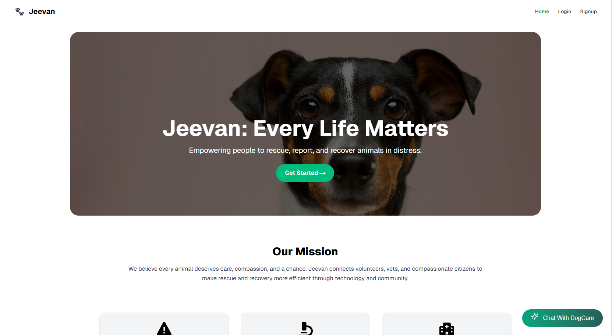

## 🎥 JEEVAN DEMO VIDEO

[](https://youtu.be/EW08L0LwFdU)


# 🐾 Jeevan - Animal Welfare App

**Jeevan** is an AI-powered web platform that enables users to **detect animal diseases from images** and **report stray or injured animals** in real-time. Built using modern tools like **Next.js**, **MongoDB**, and **Cloudinary**, it also supports **donations**, **location tracking**, and **automated email alerts**.

---

## 📦 Tech Stack

- **Frontend**: Next.js (App Router, TypeScript, Tailwind CSS)
- **Backend**: Node.js (API Routes via App Router)
- **Database**: MongoDB Atlas + Mongoose
- **Image Handling**: Cloudinary
- **Validation**: Zod
- **Authentication**: JWT, bcryptjs
- **Email**: Resend, Nodemailer
- **Payments**: Razorpay
- **Maps & Geolocation**: Mapbox
- **UI**: Accentrity UI, Tailwind, Lucide

---

## 🚀 Initial Setup Guide

### 1. 📁 Create Project Folder

```bash
mkdir jeevan
cd jeevan
```

---

### 2. 🧱 Scaffold the Project with Next.js

```bash
npx create-next-app@latest .
```

Answer prompts as follows:

```
✔ Would you like to use TypeScript?              » Yes
✔ Would you like to use ESLint?                 » Yes
✔ Would you like to use Tailwind CSS?           » Yes
✔ Would you like your code inside a `src/` dir? » Yes
✔ Would you like to use App Router?             » Yes
✔ Would you like to use Turbopack?              » No
✔ Customize the import alias?                   » No
```

---

### 3. 📦 Install Dependencies

```bash
npm install mongoose cloudinary dotenv zod bcryptjs multer jsonwebtoken nodemailer razorpay mapbox-gl @barba/core @fortawesome/react-fontawesome @fortawesome/free-solid-svg-icons @tabler/icons-react axios clsx formidable leaflet react-leaflet lottie-react lucide-react next-connect next-themes resend swr tailwind-merge tw-elements yet-another-react-lightbox jwt-decode
```

---

### 4. 🔐 Setup Environment Variables

Create your `.env` file from the sample:

```bash
cp .env.sample .env
# On Windows (PowerShell):
# copy .env.sample .env
```

#### Example `.env.sample`

```env
MONGO_URI=
TOKEN_SECRET=
DOMAIN=

RESEND_API_KEY=

CLOUDINARY_CLOUD_NAME=
CLOUDINARY_API_KEY=
CLOUDINARY_API_SECRET=

EMAIL_FROM=
PASS=

RAZORPAY_KEY_ID=your_key_id
RAZORPAY_KEY_SECRET=your_key_secret

NEXT_PUBLIC_RAZORPAY_KEY_ID=

NEXT_PUBLIC_CLOUDINARY_CLOUD_NAME=
NEXT_PUBLIC_CLOUDINARY_UPLOAD_PRESET=

NEXT_PUBLIC_MAPBOX_TOKEN=

OPENROUTER_API_KEY=
```

> 💡 You’ll need to get credentials from:
> - [Cloudinary](https://cloudinary.com/)
> - [Mapbox](https://account.mapbox.com/)
> - [Razorpay](https://razorpay.com/)
> - [Resend](https://resend.com/)
> - [OpenRouter](https://openrouter.ai/)

---

### 5. 🧠 Project Structure (Basic)

```bash
/src
  ├── /app              # Pages and API route handlers
  ├── /components       # UI components
  ├── /lib              # db.ts, cloudinary.ts, resend.ts
  ├── /models           # Mongoose schemas
  ├── /middleware.ts    # JWT & auth middleware
  ├── /helpers          # Utility functions
  ├── /Schemas          # Zod validation schemas
.env
.env.sample
```

---

### 6. ✅ Run Development Server

```bash
npm run dev
```

Visit `http://localhost:3000` in your browser.

---

## 🧪 Useful Scripts

```bash
npm run dev     # Start local server
npm run build   # Production build
npm run lint    # Run ESLint
```

---

## 🤝 Contributing

Pull requests welcome!  
Please fork the repo, make your changes, and submit a PR.

---

## 📄 License

**IIITDMJ © 2025 Jeevan Project** — All rights reserved.

